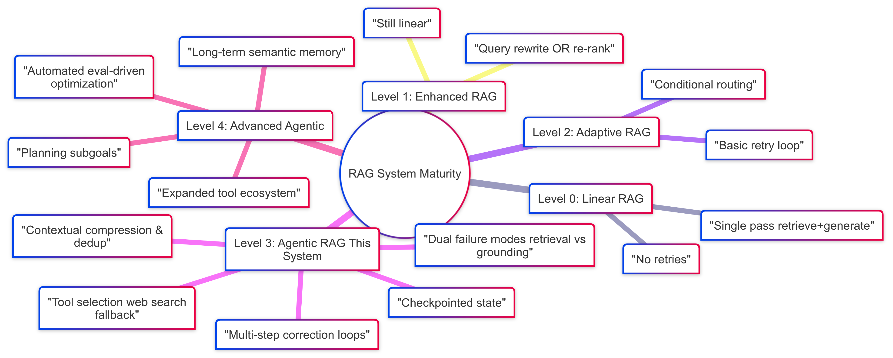
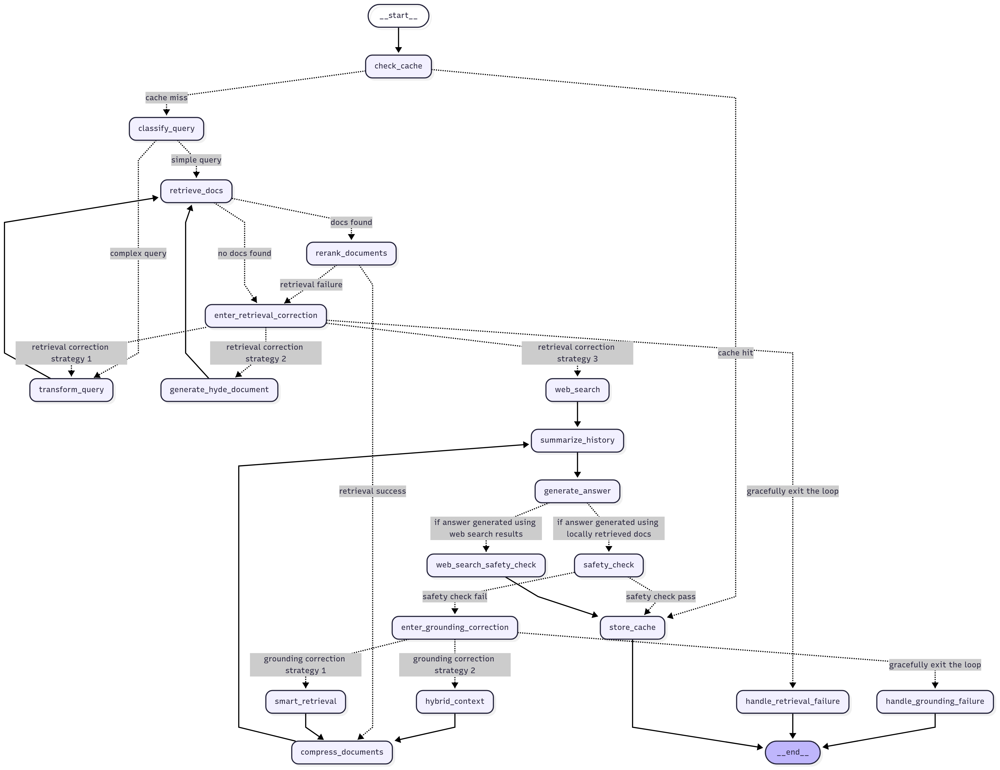

# **Autonomous Agentic RAG System: A Production-Grade Conversational AI**

[](LICENSE)
[](#)
[](#)
[](#)
[](#)

This system implements true Agentic RAG: a stateful LangGraph-driven decision workflow that adaptively rewrites queries, performs multi-phase retrieval (with fusion, re-ranking, semantic chunking, and contextual compression), validates grounding before answering, and launches targeted correction loops (retrieval vs grounding) when quality signals degrade.

It persistently checkpoints conversational state in Redis, supports multi-provider/local LLM configurations (OpenAI, Google, Ollama, Hugging Face), and can seamlessly escalate to hybrid internal + web context—all while optimizing token spend through deduplication and compression. The result is a resilient, cost-efficient, and production-grade knowledge assistant rather than a brittle linear RAG chain.

---




## **What’s New and Improved**

Since the initial version, we’ve added a number of robustness, quality, and deployment improvements:

- **Production-Grade API Security**
  - The /query endpoint is now secured, requiring clients to provide a secret token in the X-API-Key header
  - This prevents unauthorized use and protects against denial-of-wallet attacks by stopping expensive LLM and ML model computations from unknown sources.
  - To protect more endpoints, add the dependency at the router or app level, or add api_key: Annotated[str, Depends(get_api_key)] to each route you want secured (e.g., cache manipulation endpoints). 
  - The Streamlit UI has been configured to securely manage and transmit this key, ensuring secure server-to-server communication.

- **Cloud-Ready & Environment-Aware Configuration**
  - The entire application is now fully parameterized, removing all hardcoded connection details for services like Weaviate, Redis, and Ollama.
  - A new conditional configuration system allows the application to run seamlessly in different environments. It detects an APP_ENVIRONMENT variable to switch between:
    - development: Loads all settings from a local .env file for easy setup.
    - production: Uses the boto3 library to fetch secrets and API keys directly from **AWS Secrets Manager**, a secure and scalable cloud practice.

- **Document-level de-duplication across the pipeline**
  - Content-first unique key using a normalized content hash with sensible fallbacks (source + chunk_number, or explicit id). Prevents redundant snippets from inflating context windows and RRF fusion scores.

- **Semantic chunking (default) with configurable breakpoints**
  - CHUNKING_STRATEGY="semantic" with percentile/standard_deviation breakpoints to split long documents at natural boundaries, increasing retrieval precision.
  - Tunable parameters: SEMANTIC_BREAKPOINT_TYPE, SEMANTIC_BREAKPOINT_AMOUNT, SEMANTIC_BUFFER_SIZE, CHUNK_SIZE, CHUNK_OVERLAP.

- **Contextual compression in the agentic workflow**
  - An integrated DocumentCompressorPipeline: redundancy filter + LLM extraction + token cap.
  - Provider-agnostic compression LLM with a single switch: COMPRESSION_LLM_PROVIDER = openai | google | ollama | hf_endpoint.
  - Tunables: COMPRESSION_MAX_TOKENS, COMPRESSION_OVERLAP_TOKENS, COMPRESSION_REDUNDANCY_SIM.

- **Multi-provider support for compression LLMs**
  - Choose between OpenAI, Google Gemini, Ollama (local), or a hosted Hugging Face Inference Endpoint.
  - Easily switch in config.py or via .env, without changing docker-compose.

- **Dockerized Ollama (internal-only by default)**
  - Runs as a service on the Compose network (service name: ollama), not exposed to the LAN.
  - Backend connects internally via OLLAMA_HOST=http://ollama:11434.
  - Works on CPU; optional GPU enablement via a small docker-compose.gpu.yml override.

- **Robust web search integration (Tavily)**
  - Safer normalization of web search results into LangChain Document objects.

- **Advanced retrieval improvements**
  - Reciprocal Rank Fusion (RRF) to combine multiple retrieval passes (original + transformed queries).
  - Cross-encoder re-ranking (HuggingFace) with a diversity filter (Jaccard) to keep top-k diverse and relevant context.
  - Token usage accounting across nodes with automatic per-turn reset.

- **New ingestion-worker service**
  - A dedicated one-off task runner for ingestion in docker-compose.
  - Run on demand with docker compose run --rm ingestion-worker; it exits when done.

- **HNSW Index Parameters Optimization**
  - Fine-tuned vector search performance for Weaviate

- **Semantic Caching System**
  - Sub-50ms response times for common queries. For more details [click here](docs/SEMANTIC_CACHE_COMPREHENSIVE_GUIDE.md)


---

## **Core Features**

* **Autonomous & Multi-Layered Self-Correction**: The agent intelligently detects two distinct types of failures—**retrieval failure** and **grounding failure**—and triggers a dedicated, multi-step self-correction loop for each. This ensures the right recovery strategy is used for the right problem.
* **Adaptive RAG Strategies**: The agent has a toolkit of advanced RAG techniques it can deploy based on the specific failure:
    * **For Retrieval Failures**:
        * **Conversational Query Rewriting**: Transforms conversational follow-ups into precise, standalone queries.
        * **Hypothetical Document Embeddings (HyDE)**: Generates a hypothetical "perfect" answer to improve search relevance.
        * **Tool Use (Web Search)**: As a final fallback, uses the Tavily Search API to find answers if information is missing from local documents.
    * **For Grounding Failures**:
        * **Smart Retrieval & Re-ranking**: Deploys a more powerful cross-encoder model to perform a deeper, more accurate search of the internal knowledge base.
        * **Hybrid Context Synthesis**: Intelligently combines the best internal documents with fresh web search results to create a rich, synthesized context for generating a grounded answer.
* **Structured Output & Grounding**: The agent uses LLMs with structured output (Pydantic) where necessary to ensure reliable decision-making and to perform a final grounding check, and verifying the factual accuracy of every claim.
* **Local-First & Containerized**: Weaviate (vector database), Redis, Backend (FastAPI), and Ollama can all run locally via Docker Compose, ensuring data privacy, consistency, and portability.
* **Memory-Efficient Ingestion**: A streaming approach is used to parse and chunk large documents, allowing for the ingestion of very large files without overwhelming the system's memory.
* **Built-in Evaluation Framework**: The project includes an evaluation suite using the RAGAS framework to quantitatively measure the performance of the RAG pipeline.
* **Conversational Memory**: The agent remembers the context of previous interactions in a session, allowing for natural, multi-turn follow-up questions.
* **Structured Logging**: All application events are logged in a structured JSON format, making it easy to monitor, query, and analyze the system's behavior in a production environment.

---

## **How the Agent Works (Highlights)**

- **Check Semantic Cache**
  - Checks if the user query (exact as well as semantic) already exists in cache.
  - If cache is hit, a sub-50ms response is provided to the user's query. If cache miss, follows the normal RAG workflow

- **Query classification**
  - Classifies simple vs complex to decide whether to rewrite.

- **Query rewriting and HyDE**
  - Rewrites conversational queries into standalone queries.
  - Optionally generates a hypothetical “ideal” answer to guide retrieval.

- **Dual retrieval + RRF fusion**
  - Retrieves with the original and transformed queries.
  - Merges lists with Reciprocal Rank Fusion (RRF) and deduplicates.

- **Cross-encoder re-ranking + diversity filter**
  - Scores candidates with a cross-encoder (Hugging Face).
  - Applies a Jaccard-based diversity filter to keep a small but varied top-k.

- **Contextual compression**
  - Reduces context size while preserving salient facts with an LLM extractor.
  - Limits tokens per snippet and overlaps for coherence.
  - Pluggable across providers (OpenAI, Google, Ollama, HF Endpoint).

- **Answer generation + grounding check**
  - Generates a draft using the compressed, re-ranked context.
  - Verifies claims. If not grounded, enters a correction loop (smart retrieval and/or hybrid context with web results).

- **Web search integration**
  - TavilySearch with safe result normalization.
  - Gets the context from the web when internal documents don't provide sufficient context to answer the query

- **Token usage tracking**
  - Per-node token usage accumulation with per-turn reset to keep metrics meaningful.

- **Document-level de-duplication**
  - Consistent content-based keys avoid redundant context and bias.

---

## **System Architecture**



The application is built around a decision-driven agent orchestrated by LangGraph. Unlike a simple, linear workflow, this agent can dynamically route its execution based on the state of the conversation and the quality of its retrieved information.


The architecture includes:
1.  **Weaviate Vector Store**: A containerized vector database that stores the embedded document chunks for fast retrieval.
2.  **FastAPI Backend**: A containerized backend service that hosts the agentic workflow. It exposes a API for the user interface to interact with.
3.  **Autonomous LangGraph Agent**: The core of the application, defined as a stateful graph with conditional routing. The agent can classify queries, transform them, retrieve and re-rank documents, and enter a self-correction loop if necessary.
4. **Redis**: Caching/auxiliary store for performance features.
5. **Ollama** (optional, internal): Local LLM runtime for compression or main LLMs (not exposed externally).
6. **Ingestion Worker**: One-off service to ingest documents into Weaviate on demand.
7.  **Streamlit UI**: A simple, web interface that allows users to interact with the backend API in a conversational manner.

---

## **Tech Stack & Key Libraries**

* **Orchestration**: LangGraph, LangChain
* **Backend**: FastAPI, Uvicorn
* **Frontend**: Streamlit
* **Containerization**: Docker, Docker Compose
* **Vector Database**: Weaviate
* **Dependency Management**: Poetry
* **Logging**: `python-json-logger`
* **Evaluation**: RAGAS
* **Key Python Libraries**:
    * `pydantic-settings`: For managing configuration.
    * `sentence-transformers`: For text embeddings and re-ranking.
    * `langchain-openai`, `langchain-google-genai`: For interacting with LLMs.
    * `langchain-tavily`: For the web search tool.
    * `langchain-ollama`, `langchain-community`, `langchain-huggingface`, etc.

---

## **Services Overview (docker-compose)**

- weaviate: Vector database (published on localhost:8080 by default)
- redis: Redis cache (published on localhost:6379 by default)
- ollama: Local LLM service for on-prem models (internal-only; no published ports)
- backend: FastAPI app (published on localhost:8000)
- ingestion-worker: One-off job container to ingest data (no published ports; run on demand)

Security defaults:
- Ollama is not exposed to the host or network by default; only other Compose services can reach it.
- Keep secrets in .env, not in the compose file or repo.

---

## **Continuous Integration (CI)**

This project includes a Continuous Integration (CI) pipeline using GitHub Actions to ensure code quality and stability. The pipeline automatically runs on every push and pull request to the main branch.

### **CI Pipeline Stages:**

1. **Lint & Format Check:** The code is automatically checked for style consistency and formatting errors using Ruff.

2. **Unit Testing:** Although I've carried out unit and integration tests locally and used placeholder for this step. You can push `tests/` directory containing tests you've written to the remote repo and make a slight change in `ci.yml` in `Run Unit Tests with Pytest` step to run  automated tests using Pytest to verify the correctness of individual as well as integrated components.

3. **(Roadmap) AI Quality Evaluation:** The pipeline is designed to be extended to automatically run the RAGAS evaluation suite, preventing deployments that would degrade the AI's answer quality.

This automated process ensures that all contributions are held to a high standard, making the project more robust and maintainable.

---

## **Setup and Installation (Ubuntu/Linux)**

This guide provides detailed instructions to set up the project from scratch. You can run locally with Poetry (developer mode) or via Docker Compose (recommended for a consistent, reproducible stack).

### **1. Prerequisite Installation**

#### **Install Git**

```
sudo apt update
sudo apt install git
```

#### **Install Python 3.12**
```
sudo add-apt-repository ppa:deadsnakes/ppa
sudo apt update
sudo apt install python3.12 python3.12-venv python3-pip
```

#### **Install Poetry**

```
curl -sSL https://install.python-poetry.org | python3 -
# Add Poetry to your system's PATH as instructed by the installer
export PATH="/home/your-username/.local/bin:$PATH"
# Remember to add this line to your ~/.bashrc or ~/.zshrc file
```

#### **Install Docker and Docker Compose**

```
# Set up Docker's repository
sudo apt install apt-transport-https ca-certificates curl software-properties-common
curl -fsSL https://download.docker.com/linux/ubuntu/gpg | sudo gpg --dearmor -o /usr/share/keyrings/docker-archive-keyring.gpg
echo "deb [arch=$(dpkg --print-architecture) signed-by=/usr/share/keyrings/docker-archive-keyring.gpg] https://download.docker.com/linux/ubuntu $(lsb_release -cs) stable" | sudo tee /etc/apt/sources.list.d/docker.list > /dev/null

# Install Docker Engine
sudo apt update
sudo apt install docker-ce docker-ce-cli containerd.io docker-buildx-plugin docker-compose-plugin

# Add your user to the docker group (requires logout/login to take effect)
sudo usermod -aG docker $USER
```

### **2. Project Setup**

#### **Step 1: Clone the Repository**

```
git clone <your-repository-url>
cd agentic-rag-system
cp .env.example .env
# Edit .env and add your keys: OPENAI_API_KEY or GOOGLE_API_KEY, HUGGINGFACEHUB_API_TOKEN, TAVILY_API_KEY, LANGCHAIN_API_KEY, etc.
```

#### **Step 2: Configure Python and Install Dependencies**

```
# Tell Poetry to use Python 3.12 for this project
poetry env use python3.12

# Install local dependencies for the UI and ingestion scripts
poetry install
```

#### **Step 3: Set Up Environment Variables**

Create a .env file in the root of the project and add your OpenAI API key.

```
touch .env
```

**.env file contents:**

Refer the .env.example

---

## **How to Run the Application 🚀**

### **Docker-based Quick Start (Recommended)**

1. Ensure you've cloned and configured the environment

2.  **Add Your Documents**: Place your `.pdf`, `.docx`, or `.txt` files into the `data/` directory.

3.  **Build/Start the stack**: This command starts the services (containers) required to run the application.
    ```bash
    docker compose up -d
    ```
    or

    ```bash
    docker compose up --build -d
    ```
    If the build is changed.

4. Pull an Ollama model (if you plan to use Ollama for compression or main LLM)

    ```bash
    docker compose exec ollama ollama pull llama3.1:8b
    ```

    Models are cached in the ollama_data volume and persist across restarts.

5.  **Ingest Your Data**: Run this script to process your documents (placed in data/) and load them into the vector database.
    - **Dev/local mode**:
    ```bash
    poetry run python -m agentic_rag.scripts.run_ingestion
    ```
    or

    ```bash
    poetry run ingest
    ```
    - **Docker-based**:
    ```bash
    docker compose run --rm ingestion-worker
    ```


6.  **Launch the UI**: Start the Streamlit user interface.
    ```bash
    poetry run streamlit run ui/streamlit_app.py
    ```
    
    Navigate to **http://localhost:8501** in your browser. The UI talks to the backend at http://localhost:8000.

    Ask questions about your ingested documents. The agent will retrieve, re-rank, compress, generate, and provide verifed, grounded answers.

    Optionally, you can also directly send POST requests to `/query` endpoint using curl, postman or other similar methods.

    e.g.
    ```bash
    curl -X POST 'http://localhost:8000/query' -H 'Content-Type: application/json' -d '{"query":"User query","session_id":"test-session-1"}'
    ```


7.  **Delete ingested data**: Run this script when you need to delete the indexed data (in case you change/experiment with embeddings, chunking, retrieval settings).
    ```bash
    poetry run python -m agentic_rag.scripts.delete_indexed_data
    ```
    or

    ```bash
    poetry run delete-index
    ```

---

## **Optional: GPU Acceleration for Ollama**

If you have an NVIDIA GPU + drivers and NVIDIA Container Toolkit installed, you can enable GPU for the ollama service using an override file.

- Create docker-compose.gpu.yml (see example in repo).
- Start with GPU:

```bash
docker compose -f docker-compose.yml -f docker-compose.gpu.yml up -d
```

- Verify devices inside the Ollama container:

```bash
docker compose exec ollama sh -lc 'ls -l /dev/nvidia* || true'
```

---

## **Switching Compression Providers**

Control contextual compression’s LLM in one place without changing Docker:

- In .env (or in config.py defaults):
  - COMPRESSION_LLM_PROVIDER=ollama | openai | google | hf_endpoint

Examples:
- Use Ollama (local):
  - COMPRESSION_LLM_PROVIDER=ollama
  - COMPRESSION_LLM_MODEL=llama3.1:8b
  - Compose sets OLLAMA_HOST=http://ollama:11434 for the backend automatically.

- Use OpenAI:
  - COMPRESSION_LLM_PROVIDER=openai
  - Ensure OPENAI_API_KEY in .env.

- Use Google:
  - COMPRESSION_LLM_PROVIDER=google
  - Ensure GOOGLE_API_KEY in .env.

- Use a hosted Hugging Face Inference Endpoint:
  - COMPRESSION_LLM_PROVIDER=hf_endpoint
  - HF_COMPRESSION_MODEL=mistralai/Mistral-7B-Instruct-v0.3
  - HUGGINGFACEHUB_API_TOKEN in .env.

Tip: Avoid setting COMPRESSION_LLM_PROVIDER directly in docker-compose.yml unless you explicitly want a deployment-time override. Pydantic BaseSettings reads OS env first; values in compose will override config.py defaults and .env.

---

## **Testing Connectivity to Ollama**

If you want to quickly confirm backend -> Ollama connectivity without curl, run:

```bash
docker compose exec backend python
```
And then run below script to ensure connectivity:

```bash
import sys, urllib.request
try:
    with urllib.request.urlopen("http://ollama:11434/api/version", timeout=5) as r:
        print(r.read().decode())
except Exception as e:
    print("ERR:", e, file=sys.stderr); sys.exit(1)
```

And a generation test (requires a pulled model, e.g., llama3.1:8b):

```bash
import json, sys, urllib.request
data=json.dumps({"model":"llama3.1:8b","prompt":"Say hello in one sentence."}).encode()
req=urllib.request.Request("http://ollama:11434/api/generate", data=data, headers={"Content-Type":"application/json"})
try:
    with urllib.request.urlopen(req, timeout=30) as r:
        print(r.read(2000).decode())
except Exception as e:
    print("ERR:", e, file=sys.stderr); sys.exit(1)
```

---


## **Evaluation**

This project includes a built-in evaluation framework using **RAGAS** (Retrieval-Augmented Generation Assessment) to quantitatively measure the performance of the RAG pipeline. This allows for a data-driven approach to improving the system and comparing the impact of different techniques.

The evaluation measures the following key metrics:

* **Faithfulness**: Measures how factually accurate the generated answer is based on the provided context.
* **Answer Relevancy**: Assesses how relevant the generated answer is to the user's question.
* **Context Precision**: Evaluates the signal-to-noise ratio of the retrieved context.
* **Context Recall**: Measures the ability of the retriever to fetch all the necessary information to answer the question.

### **How to Run the Evaluation**

1.  **Generate the Evaluation Results:**
    Run the following command from the root of the project. This will run the RAG chain against a ground truth dataset and save the results to a `ragas_evaluation_results.csv` file.

    ```bash
    poetry run python -m agentic_rag.evaluation.evaluate
    ```

2.  **Visualize the Results:**
    To view the results in a user-friendly web interface, run the following command:
    ```bash
    poetry run streamlit run src/agentic_rag/evaluation/evaluation_ui.py
    ```
    This will start a Streamlit application where you can view the evaluation metrics in a clean, interactive table.

---

## **Security Notes**

- Ollama is internal by default (no ports published). Keep it that way unless you explicitly need host access.
- Store secrets only in .env, never in code or committed files.
- If you must expose Ollama, bind to loopback only: ports: ["127.0.0.1:11434:11434"] and use a firewall.

---

## **Future Ideas and Roadmap**

* **CI/CD for AI Quality**: Add a step in existing CI workflow that runs the RAGAS evaluation. Compare the metrics from newly generated eval results with the baseline metrics to prevent deploying a regression.
* **Deployment**: Package and deploy the application to a scalable, production-ready environment like Google Cloud Run or AWS App Runner.

---

## **License**

This project is licensed under the Apache License 2.0 - see the [LICENSE](./LICENSE) file for details.  

---

## **Disclaimer**

This software may generate or relay AI model outputs that can be inaccurate, incomplete, or contextually inappropriate. You are responsible for validating critical information, ensuring regulatory / data protection compliance, and applying proper human oversight in production deployments. No warranty is provided—use at your own risk. See [DISCLAIMER](./DISCLAIMER.md) if present for additional details.

---

Happy building! If you run into issues, please open an issue with logs and reproduction steps.

